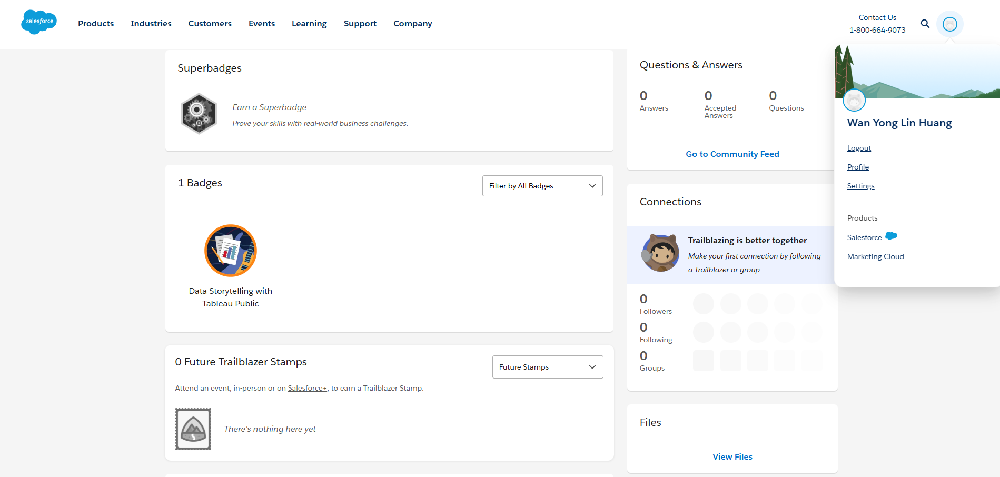
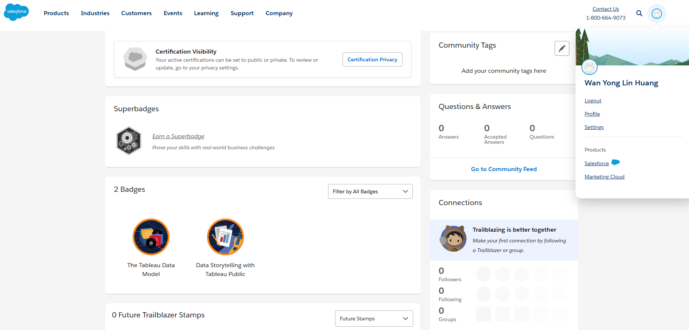
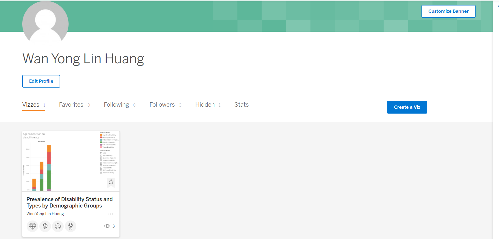
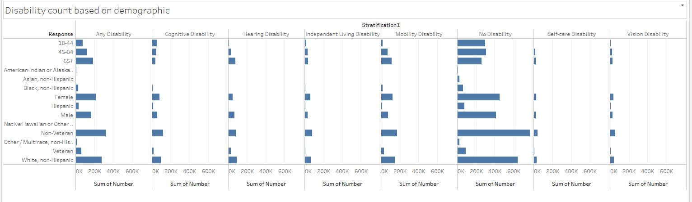
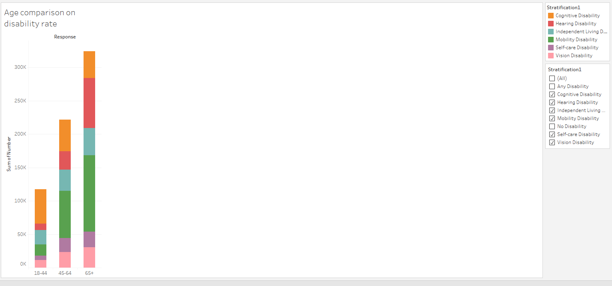

# Tableau Trailhead basic showcase

## Evidence
Module 1 completion

Module 2 completion

Tableau Public viz

Sheet 1

Sheet 2

Tableau Public viz URL: https://public.tableau.com/views/PrevalenceofDisabilityStatusandTypesbyDemographicGroups/Sheet2?:language=en-US&:sid=&:redirect=auth&:display_count=n&:origin=viz_share_link

## Reflection
An important point that I learned from Data Storytelling with Tableau Public is that clarity is a must when it comes to meaninful showcase and comparison of data. Something important from The Tableau Data Model is that ensuring proper connection of relationships between tables helps with data extraction. It is specially important when there are multiple tables with similar column names which could cause confusion when relationships are not properly aligned. An example where Tableau’s data model and visual storytelling comes in handy is when trying to look for patterns and trends in healthcare settings like a hospital or during healthcare pandemics in a city or state. Tableau's functionality allows one to see outliers in data and help pinpoint pain points or problem causers.